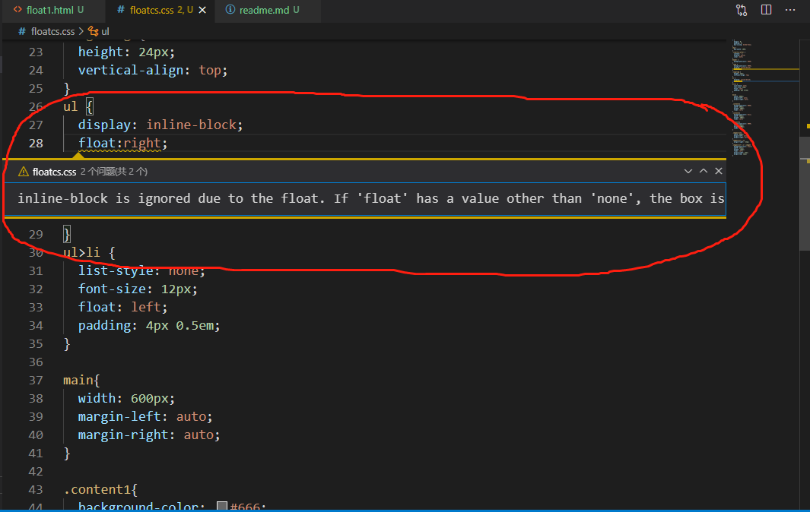

# Float布局

## 步骤

* 在子元素里加上 float:left; 和 width
* 在父元素里加 .clearfix

## .clearfix书写

```css
.clearfix:after{
    content:'';
    display:block;
    clear:both;
}
```

## 遇到的问题

如果图片不能填充完整背景色，下方有空隙，css输入 vertical-align:top/middle;(缩写va) 解决。

如果需要将某个块元素居中定位时，先给它一个固定的宽度数值，然后再用margin-left:auto; margin-right:auto; 居中(不推荐使用margin:0 auto; 因为"0"可能会覆盖前面已指定的上下外边距)。

等距排列时，往往会因为增加的margin左右边距而超出父级的边框范围，这时候要在原父元素内，子元素外再加一个父元素，用来负margin缩进(margin-left/right:-10px;)。



## 实际网页效果展示链接

[效果展示](http://js.jirengu.com/qosecilama/1/edit?html,css,output)